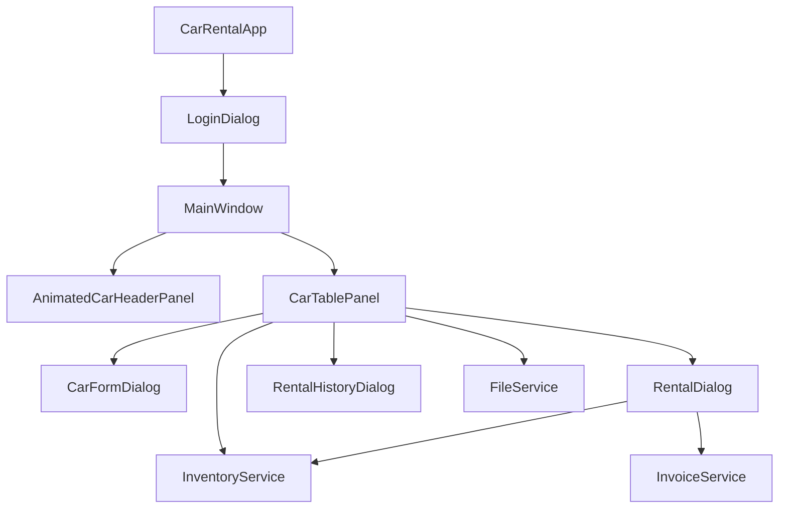

# UrusSewa – Developer Documentation & System Architecture Guide

Welcome to the developer documentation for the **UrusSewa Car Rental System**. This guide provides an in-depth view of the system architecture, code design patterns, implemented Object-Oriented Programming (OOP) concepts, and data storage systems.

---

## 🏛️ System Architecture Design

UrusSewa follows a highly decoupled **Model-View-Service** architectural pattern. This pattern keeps the source code modular, clean, and extremely simple to maintain:



- **Model Layer (`carrental.model`)**: Holds raw data structures representing system entities (e.g. `Car`, `Rental`).
- **Service Layer (`carrental.service`)**: Holds business logic (e.g. price computation, booking calendar scheduling) and persistence logic (e.g. CSV loading, PDF invoice compilation).
- **UI/View Layer (`carrental.ui`)**: Handles visual components, custom animation threads, and event handling hooks.

---

## 💎 Implemented OOP Principles

This codebase is a showcase of core Object-Oriented Programming principles, custom-made to meet the requirements of the course rubrics:

### 1. Encapsulation

All attributes within the model classes (`Car.java`, `Rental.java`) are declared **`private`**. They cannot be modified directly by outside classes.
Access is strictly controlled via:

- **Constructors**: To safely initialize valid entities.
- **Public Getters & Setters**: Providing read-only boundaries or safe updates (e.g., trimming white-space, input sanitization).

_Example (from `Car.java`):_

```java
private String brand;
private double pricePerDay;

public String getBrand() { return brand; }
public void setBrand(String brand) { this.brand = brand; }
```

### 2. Abstraction

The system defines the common contract of a car fleet vehicle inside the **`abstract class Car`**. It provides common logic but leaves details (like exact engine properties and CSV serialization) to subclass instances.
It defines `abstract` methods that subclasses **must** implement:

```java
public abstract String getCarType();
public abstract double calculateRentalCost(int days);
public abstract String toFileString();
```

### 3. Inheritance

Inheritance promotes code reuse. Subclasses inherit all common properties (`id`, `brand`, `model`, `pricePerDay`) from `Car.java`, but specialize to add their own properties:

- **`StandardCar`**: Reuses core properties, adding `fuelCapacity`.
- **`ElectricCar`**: Reuses core properties, adding `batteryCapacity`.
- **`HybridCar`**: Reuses core properties, adding both `batteryCapacity` and `fuelCapacity`.

_Example (from `ElectricCar.java`):_

```java
public class ElectricCar extends Car {
    private int batteryCapacity;

    public ElectricCar(String id, String brand, String model, double price, boolean avail, int battery) {
        super(id, brand, model, price, avail); // Pass core properties to parent
        this.batteryCapacity = battery;
    }
}
```

### 4. Polymorphism

Polymorphism allows dynamic method dispatching at runtime. For example, when calculating the rental cost, the system calls `car.calculateRentalCost(days)` without needing to know if the object is Petrol, Hybrid, or Electric. The JVM determines the correct method dynamically:

- **StandardCar**: Base price × days (no surcharge).
- **ElectricCar**: Base price × days × 1.10 (10% surcharge for EV infrastructure).
- **HybridCar**: Base price × days × 1.05 (5% surcharge for hybrid systems).

---

## 💾 Storage & Data Formats

Data is persisted in simple comma-separated values (CSV) text databases in the project root:

### 1. Car Fleet Database (`car_inventory.txt`)

Each line stores a single vehicle. Subclasses are prefixed with their type token:

- **Format**: `TYPE,id,brand,model,pricePerDay,available,specifics...,imageUrl`
- _Standard Example_: `STANDARD,P001,Perodua,Myvi,120.0,true,36,https://url...`
- _Electric Example_: `ELECTRIC,E001,Tesla,Model 3,450.0,true,75,https://url...`
- _Hybrid Example_: `HYBRID,H001,Toyota,Camry Hybrid,280.0,true,18,50,https://url...`

### 2. Rental Bookings Database (`rental_history.txt`)

Each line stores an invoice record of a rental transaction:

- **Format**: `rentalId,carId,customerName,customerIC,customerPhone,rentalDays,totalCost,rentalDate,status`
- _Example_: `R001,E001,Haziq,900101-14-5555,0123456789,3,1485.0,2026-05-30,ACTIVE`

---

## ⚙️ Core Developer Components

### 🔄 Real-Time Live Search (`CarTablePanel.java`)

Uses a Swing `DocumentListener` attached to the search text box's document:

```java
txtSearch.getDocument().addDocumentListener(new DocumentListener() {
    public void insertUpdate(DocumentEvent e) { handleSearch(); }
    public void removeUpdate(DocumentEvent e) { handleSearch(); }
    public void changedUpdate(DocumentEvent e) { handleSearch(); }
});
```

This filters the `JTable` dynamically on every key stroke using a case-insensitive matching algorithm (`String.contains()` in lower-case).

### 🎨 Animated 60 FPS Header (`MainWindow.java`)

Implements an `AnimatedCarHeaderPanel` extending `JPanel`. A `javax.swing.Timer` triggers every 16ms (60 FPS) to shift the X-coordinate of a beautifully rendered vector sports car across the header. When the car reaches `panelWidth + 100`, it wraps back to `-120`.

### 📄 Zero-Dependency PDF Writer (`InvoiceService.java`)

Compiles ASCII-escaped streams directly into **PDF 1.4** format binary files without requiring external heavy libraries like iText or PDFBox:

- Writes document structures (`Catalog`, `Pages`, `Page`, `Content Stream`, and standard `Courier` font metrics).
- Generates clear printable invoice templates saved inside the `./invoices` directory.

---

## 🔎 Class-by-class Summary (Short, for students)

- `src/carrental/model/Car.java` — Abstract parent for all vehicle types.
  - Fields: `id, brand, model, pricePerDay, available, imageUrl`.
  - Key abstract methods: `getCarType()`, `calculateRentalCost(int days)`, `toFileString()`.

- `src/carrental/model/StandardCar.java` — Petrol/diesel cars.
  - Implements `calculateRentalCost(days)` as `pricePerDay * days` (no surcharge).

- `src/carrental/model/ElectricCar.java` — Electric vehicles.
  - Adds `batteryCapacity` and applies a **10% surcharge** to rental cost.

- `src/carrental/model/HybridCar.java` — Hybrid vehicles.
  - Adds `batteryCapacity` and `fuelCapacity`, applies a **5% surcharge**.

- `src/carrental/model/Rental.java` — Rental transaction record.
  - Stores `rentalId, carId, customerName, customerIC, phone, rentalDays, totalCost, rentalDate, status`.
  - Helpers: `fromFileString()`, `toFileString()`, `getReturnDate()`, `isOverdue()`.

- `src/carrental/service/FileService.java` — All file I/O for both databases.
  - `loadInventory()` / `saveInventory()` read/write `car_inventory.txt`.
  - `loadRentals()` / `saveRentals()` read/write `rental_history.txt`.
  - `getDefaultInventory()` seeds example cars on first run.

- `src/carrental/service/InventoryService.java` — Business rules & in-memory state.
  - Stores `ArrayList<Car> carInventory` and `ArrayList<Rental> rentalHistory`.
  - Methods include: search, add/remove car, generate car/rental IDs, availability checks, overlap detection, transition BOOKED→ACTIVE.

- `src/carrental/service/InvoiceService.java` — Small PDF writer.
  - Builds a simple single-page PDF using raw PDF objects (no external libs).

- `src/carrental/ui/*` — Swing UI components (look at `MainWindow` and `CarTablePanel` first).
  - `MainWindow` wires services to the UI, loads data, and starts a file watcher to auto-reload external edits.
  - `CarTablePanel` contains the table, search, and Admin actions (Add/Edit/Delete/Rent/Return).

## 🔁 Common Workflows (trace these to understand runtime)

- Application start: `CarRentalApp.main()` → `LoginDialog` → `MainWindow` → `CarTablePanel`.
- Loading data: `MainWindow.loadData()` calls `FileService.loadInventory()` → `InventoryService.setInventory()`.
- Adding a car: `CarFormDialog.handleAdd()` → `InventoryService.addCar()` → `FileService.saveInventory()` → UI refresh.
- Renting a car: `CarTablePanel.handleRent()` → `RentalDialog.handleConfirm()` → validation → create `Rental` → `inventoryService.addRental()` → `fileService.saveRentals()` → `InvoiceService.generateInvoice()`.

## 🛠️ Tips for Students (Where to edit safely)

- UI-only tweaks: edit files under `src/carrental/ui/` (colors, layout, labels) without touching persistence logic.
- Business rules: `InventoryService` is the right place for changes to availability, overlap rules, or ID generation.
- Storage format: if you change `toFileString()` signatures, update `FileService.parseCarLine()` and `Rental.fromFileString()` accordingly.

---

If you'd like, I can now:

- (A) Add inline comments into each Java file summarising what each method does, OR
- (B) Generate a single markdown file with annotated code snippets for study, OR
- (C) Produce a short tutorial that walks through adding a new feature (e.g., discounts).

Tell me which option you prefer and I'll proceed.
